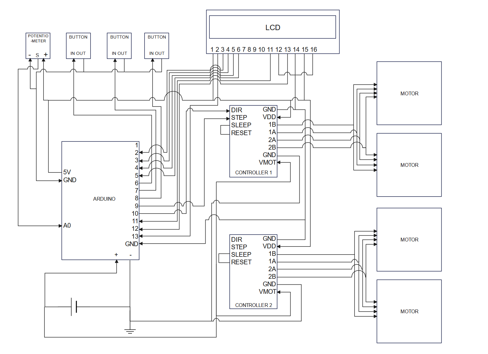

# DIY Tein EDFC 
Note: This project is mostly done, but have not been tested extensivly. Use at your own risk!

## Hardware:
- Arduino
- Buttons and dials
- 4 Stepper motors
- Stepper drivers
- LCD
Here is a circuit diagram of my prototype: 

